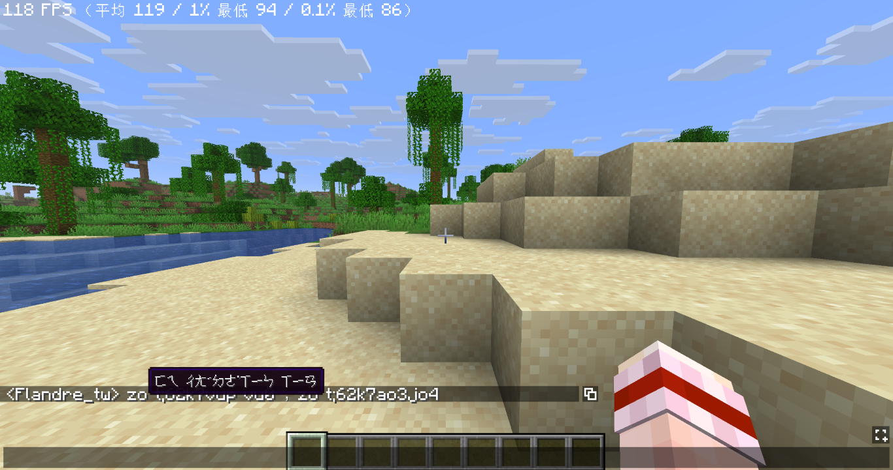
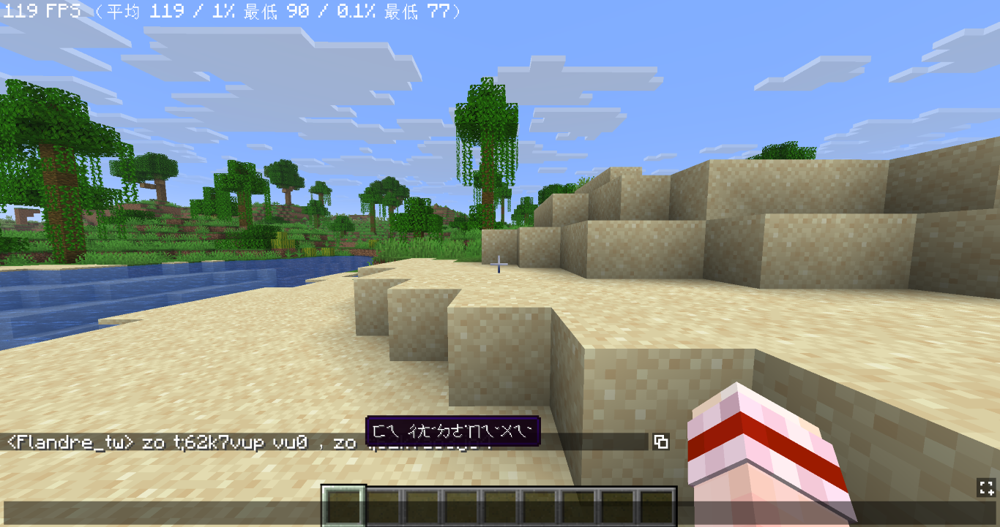

<p align="center">
  
</p>

# 注音亂碼翻譯蒟蒻 - Bopomofo Translator

[English](README.md) | [臺灣正體中文](README-zh_TW.md)

> **注意事項**  
> 本專案使用 **Gemini 氛圍編碼 (Vibe Coding)** 撰寫，由 AI 魔法與過量的數位薯條驅動。**使用請注意**！如果您發現 UI 開始跳舞或程式碼看起來像某種神秘咒語，別擔心——那只是「氛圍」到位了。

「你打的那串火星文，我全看懂了！！」

## 這是什麼酷東西？

來自 Minecraft 宇宙的救星⸺**注音亂碼翻譯蒟蒻**，是個專門拯救「忘記切換輸入法」的失智瞬間的超智慧模組！

你是不是常常在伺服器打字時，忘記切換中文輸入法，結果送出了一串像 `ji394su3` 這樣的神祕代碼？
然後底下就會有一堆人回你 `?`，你還得再切換輸入法重打一次「我愛你」？

別擔心！這款 **Fabric 用戶端專用**模組就是為此而生！
它會在保留原文、把社死現場原封不動留給大家笑的同時，只要把滑鼠游標停留在亂碼上，就會**溫柔地浮現出翻譯正確的注音懸浮文字**！

最棒的是，**這是一個純用戶端模組**，伺服器完全不需要安裝配置，你一個人裝，就能擁有看破整個伺服器火星文的超能力！





## 超狂魔法特性

* **嚴格的注音積木演算法**  
  我們不會智障地把正常的英文單字 `hello` 翻成 `ㄘㄍㄠㄠㄟ`！程式內建了超級嚴謹的大千鍵盤音節檢驗，只有**完完全全**符合「聲母+介音+韻母+聲調」的火星片段才會被啟動翻譯！一般正常的英文對話依然安然無恙。

* **無感且精準的切割技術**  
  就算跑到像 Hypixel 這種，會把自訂稱號 `[VIP] Flandre_tw:` 跟聊天訊息用髒髒的寫法黏在一起的伺服器，模組也能完美地將「稱號」與「對話」切開！你的游標只有在「精準指到亂碼時」才會大顯神威。

* **蹲下 Shift 鍵誤觸校正**  
  在麥塊裡一邊潛行蹲下一邊打字，結果打出 `JI#CL#` 導致翻譯大當機？我們連這個都想到了！內建 Shift 解碼器，無論是數字變成了特殊符號、還是大小寫錯亂，通通在後台自動歸位還原！

* **全形字元降維打擊**  
  就算你卡鍵切到了全形模式，打出了碩大的 `ｊｉ３`，它也能在後台默默把它壓成半形，並精準地把 `ㄨㄛˇ` 餵到你嘴邊！同時智慧保留中文全形標點符號，絕不誤轉成注音按鍵。

* **標點符號與多詞不破碎**  
  以往打字時若緊貼全形逗號、句號、問號等標點或英文符號，容易導致音節混亂或翻譯斷裂破碎。全新邊界分離演算法能智慧識別非注音符號，即使整句混雜中文、全形標點與多組注音，例如「非常的新鮮，非常的美味，zo t;62k7vup vu0 ，zo t;62k7ao3jo4」，每個注音片段依然能夠完整獨立識別與翻譯，標點原樣保留不破碎！

* **手速過快與聲調提前自動校正**  
  打字飛快時兩手手指同時落下，不小心把聲調鍵按在韻母前面？例如「我愛你」`ji394su3` 打成了 `ji394s3u`，先按了 `3` 再按 `u`；或是「這是一個」`5k4g4u6ek7` 打成了 `5k4g46uek7`，先按了 `6` 再按 `u`，導致整個翻譯大翻車？
  別慌！全新升級的智慧音節修復引擎 `fixInvertedTone` 幫你擺平：
  - **結構角色自動重排**：大千式注音鍵盤的聲母、介音、韻母、聲調各自獨立。當系統偵測到聲母、聲調與介音或韻母的顛倒組合，例如 `s3u` 修正為 `su3`、`148` 修正為 `184`、`2u3l` 修正為 `2ul3`，會在解析前自動把提早落下的聲調移回字尾歸位！
  - **零聲母字完美支援**：即使遇到沒有聲母的字，例如「一」`6u` 修正為 `u6`、「愛」`49` 修正為 `94`，甚至連字盲打如 `5k4g46uek7` 修正為 `5k4g4u6ek7`，也能智慧識別並修正！
  - **負向先行斷言安全防護**：全規則搭載 `(?![3467])` 防護，確保只有在該字母後面「沒有其他獨立聲調」時才會觸發移動，徹底杜絕跨字誤傷相鄰單字的悲劇。

## 安裝與使用

1. 確保已下載對應 Minecraft 版本的模組，並且已安裝 **Fabric/Quilt Loader**。
2. 將編譯好的 `.jar` 檔案丟進您的 `mods` 資料夾。
3. 進入遊戲，打開聊天室，享受當全伺服器最高級火星文翻譯官的快樂！

## 開發與測試指南

本專案採用 **Stonecutter** 來進行 1.20.1、1.21.11 與 26.2 的跨版本開發與編譯管理，無需手動切換分支或複製程式碼。您可以透過以下 Gradle 指令來進行開發與測試：

* **編譯所有支援的版本：**
  ```bash
  .\gradlew clean buildAndCollect
  ```
  編譯完成的各版本 `.jar` 檔案會集中放置於專案根目錄的 `build/libs/{mod.version}/` 下。

* **啟動特定版本的測試客戶端：**
  我們已經將各個版本的測試環境完全隔離，擁有各自獨立的 `run` 目錄，您可以直接透過指令啟動特定版本測試，例如：
  - 測試 1.20.1 版本：`.\gradlew :1.20.1:runClient`
  - 測試 1.21.11 版本：`.\gradlew :1.21.11:runClient`
  - 測試 26.2 版本：`.\gradlew :26.2.x:runClient`

* **切換 IDE 活躍編輯版本：**
  ```bash
  .\gradlew "Set active project to 1.21.11"
  .\gradlew "Set active project to 26.2.x"
  ```

## 常見問題

**Q: 其他沒裝這個模組的玩家，看得到翻譯嗎？**  
A: 看本來就不懂的話，當然繼續看不懂啊！這是純**用戶端模組**，所有的翻譯魔法都在您的電腦內發生。您裝了您享受，別人沒裝別人就繼續滿頭問號 `???`。

**Q: 自己打的火星文自己也能翻譯嗎？**  
A: 可以！它會捕捉聊天室裡所有的 `ChatHud` 訊息，無論是別人發的還是你發的，通通逃不過它的法眼。

**授權與著作權**  
版權所有 © 2026 flandretw | 本專案採用 [MIT License](LICENSE) 授權
