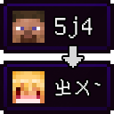
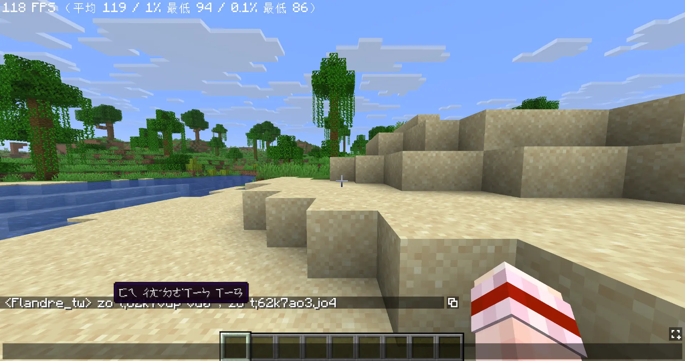
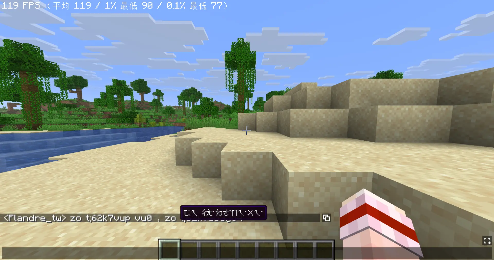
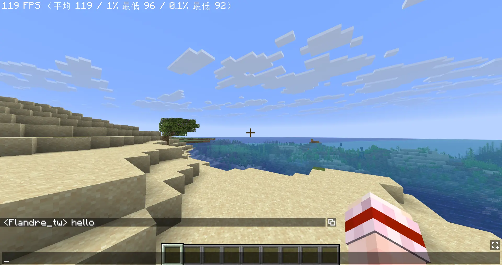
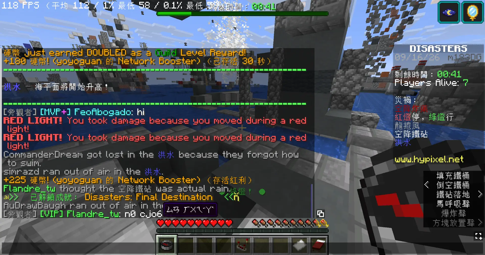
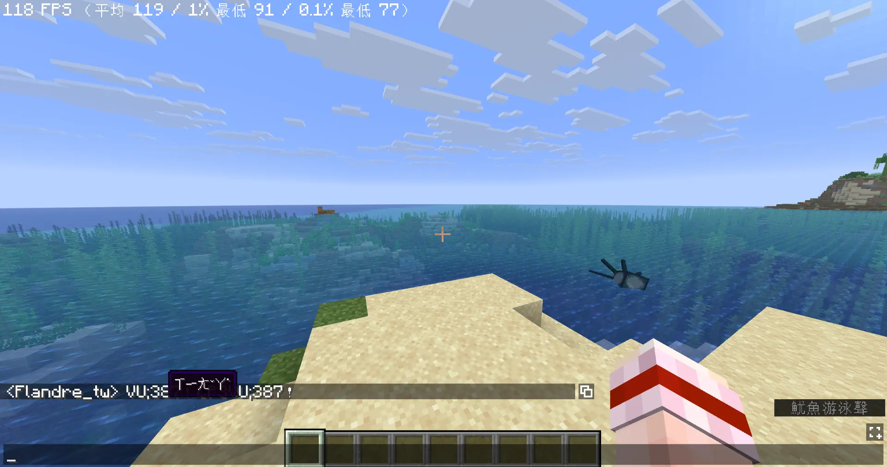
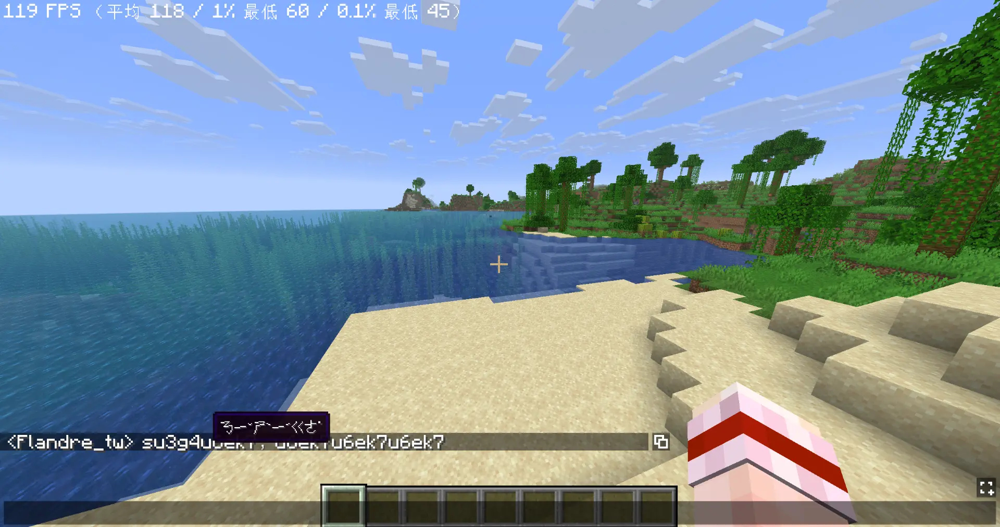
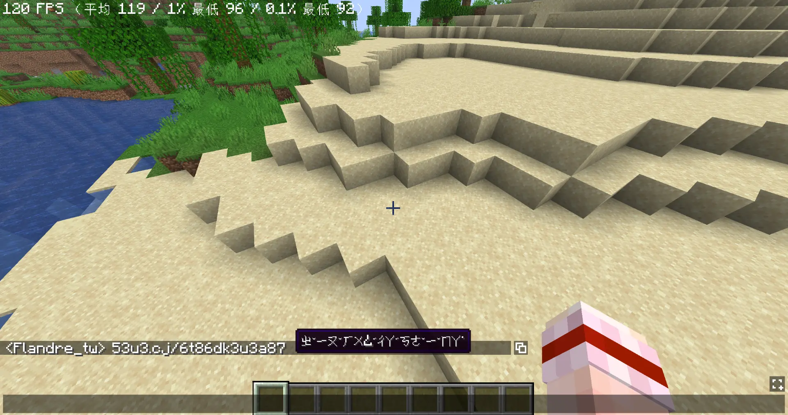
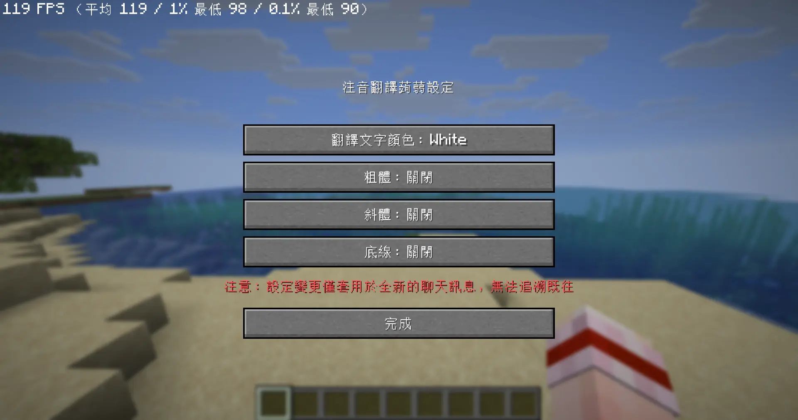

<p align="center">
  
</p>

# Bopomofo Converter

[English](README.md) | [臺灣正體中文](README-zh_TW.md)

> **Disclaimer**  
> This project was forged using **Gemini "Vibe Coding"**, fueled by AI magic and excessive amounts of digital fries. **Proceed with caution**! If the UI starts dancing or the code looks like a magical incantation, don't worry—it's just the vibe.

"I can read all the alien gibberish you typed."

## What is this?

**Bopomofo Converter** is a client-side Fabric mod designed to save you from those awkward moments when you forgot to switch your input method.

Do you often forget to switch to your Chinese input method on a server, sending out cryptic codes like `ji394su3`?
And then the chat gets flooded with `?`, forcing you to switch your keyboard and awkwardly re-type "I love you"?

This mod leaves your original message intact for everyone to laugh at, while displaying hover text with the converted Bopomofo whenever you move your cursor over the gibberish.

Best of all, this is a purely client-side mod. The server requires zero installation. You install it yourself, and you're good to go.





## Features

* **Strict Bopomofo Building-Block Algorithm**  
  Won't randomly translate normal English words like `hello` into `ㄘㄍㄠㄠㄟ`. Built-in syllable validation ensures only text matching the "Initial + Medial + Final + Tone" layout gets translated, leaving standard English conversations untouched.

  

* **Chat & Title Boundary Separation**  
  On servers that glue player titles directly to chat messages (like Hypixel's `[VIP] Flandre_tw:`), the mod cleanly separates the title from the message and only translates the gibberish portion.

  

* **CapsLock & Full-Width Handling**  
  Accidentally typed "想啊！很想啊！" (`VU;387！CP3VU;387！`) with CapsLock on, or full-width "想" (`ＶＵ；３`)? The mod silently normalizes characters into half-width lowercase to resolve "想" (`ㄒㄧㄤˇ`), while keeping full-width punctuation marks intact.

  

* **Punctuation & Multi-Word Segmentation**  
  Words adjacent to full-width punctuation won't shatter syllables. Mixed sentences containing Chinese, punctuation, and multiple Bopomofo phrases—such as "你是一個，一個一個一個" (`su3g4u6ek7，u6ek7u6ek7u6ek7`）—are parsed independently with punctuation preserved.

  

* **Rapid-Typing Tone Correction**  
  Typing too fast can cause the tone key to land before the vowel (e.g., typing "有" mistakenly as `u3.` or "紅" as `cj6/`). The built-in syllable recovery automatically recognizes key roles on standard DaQian keyboards and shifts misplaced tones back to the end of the syllable. It seamlessly supports zero-initial syllables, continuous typing without spaces, and includes safety guards to ensure tones are only adjusted when a syllable lacks one, avoiding accidental corruption of adjacent words.

  

## Setup & Installation

1. Ensure you have installed **Fabric Loader** and **Fabric API** for your Minecraft version.
2. Download the mod `.jar` file matching your Minecraft version and place it into your `.minecraft/mods` folder.
3. Launch Minecraft, open the chat, and enjoy deciphering everyone's Martian gibberish!
4. Customize appearance anytime:
   Open settings via [Mod Menu](https://modrinth.com/mod/modmenu), or type `/bopomofo` (or `/bopomofo-converter`) in chat.



## Development & Testing

This project uses **Stonecutter** for cross-version 1.20.1, 1.21.11, 26.1, and 26.2 development and build management, avoiding the need to manually switch branches. Use the following Gradle commands:

* **Build all supported versions:**
  ```bash
  .\gradlew clean buildAndCollect
  ```
  Compiled `.jar` files will be output to `build/libs/{mod.version}/` in the project root.

* **Run a specific version's test client:**
  Test environments for each version are completely isolated, each with dedicated `run` directories. You can launch them directly:
  - For 1.20.1: `.\gradlew :1.20.1:runClient`
  - For 1.21.11: `.\gradlew :1.21.11:runClient`
  - For 26.1: `.\gradlew :26.1.x:runClient`
  - For 26.2: `.\gradlew :26.2.x:runClient`

* **Switch active project in IDE:**
  ```bash
  .\gradlew "Set active project to 1.21.11"
  .\gradlew "Set active project to 26.1.x"
  .\gradlew "Set active project to 26.2.x"
  ```

## FAQ

**Q: Can players without this mod see the translations?**  
A: Nope. This is a purely client-side mod. Translations happen locally on your machine. Those without it will remain confused.

**Q: Does it translate my own messages?**  
A: Yes, it processes all messages in the chat HUD, including your own.

**License & Copyright**  
Copyright © 2026 flandretw | This project is licensed under the [MIT License](LICENSE).
